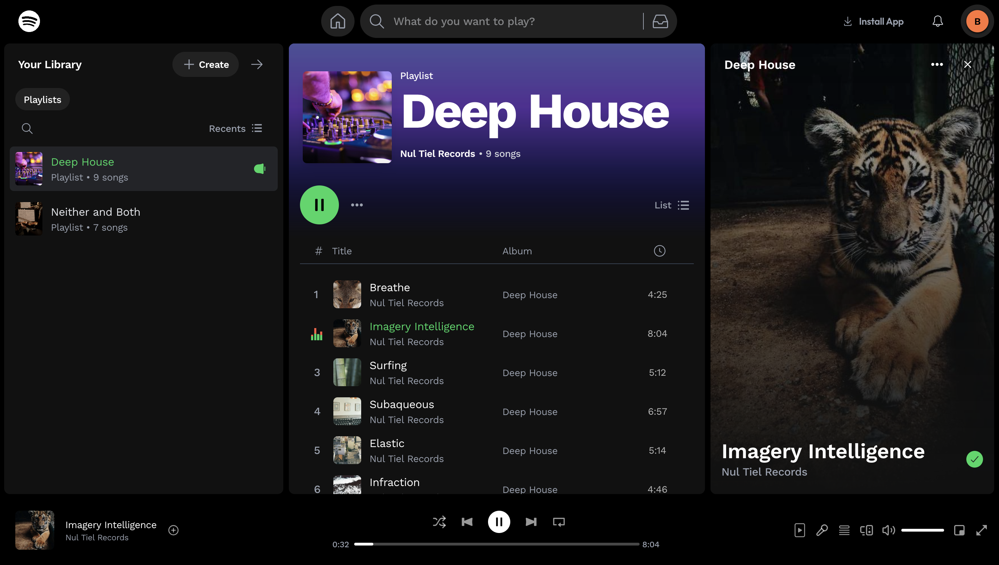

# Linear Media Player – Spotify Clone




Welcome! This is a responsive, visually polished Spotify-inspired media player built for the web. The experience includes a full desktop version and a streamlined mobile view with advanced keyboard controls and a styled playback experience. The top screenshot is the finished project, and the bottom screenshot is to show the goal that was intended to match (Spotify).

---

## Features

- Responsive UI (Desktop: Spotify-style, Mobile: custom compact player)
- Audio playback with:
  - Play / Pause
  - Next / Previous track
  - Seek progress bar
  - Volume control with visual feedback
  - Shuffle / Repeat functionality
- HUD overlay for volume + playback feedback
- Mute/unmute control
- Fully keyboard-controllable media experience
- Global state using React Context (track selection, volume, HUD)
- Custom-styled sliders with hover states
- Preloaded playlist from local JSON (no API calls)
- Built using React, Tailwind CSS, and modern TypeScript best practices

---

## Keyboard Shortcuts

| Key          | Action                |
| ------------ | --------------------- |
| `Space`      | Play / Pause          |
| `ArrowUp`    | Volume Up             |
| `ArrowDown`  | Volume Down           |
| `ArrowRight` | Seek forward (5 sec)  |
| `ArrowLeft`  | Seek backward (5 sec) |
| `M`          | Mute / Unmute         |
| `S`          | Toggle Shuffle        |
| `R`          | Toggle Repeat         |
| `N`          | Next Track            |
| `P`          | Previous Track        |

Each shortcut triggers visual feedback via the HUD, mimicking a native media experience.

---

## Linear Media Player

Hey, thanks for taking the time to work on this exercise. We're excited to see what you come up with –
the goal is to create an audio player for playing a predefined playlist of audio files. Think of it
like a stripped-down version of Spotify or the classic Winamp.

### Getting started

Clone this repo which was created _just for you_, make it yours and let us know once the project is complete by pushing
your commits and replying through email.

You can use `npm` to install the dependencies and run the basic React project. Feel free to add any additional libraries
or frameworks you need.

```bash
npm install
npm run dev
```

### Requirements

We'd like to see a working media player that can play through a playlist of audio files (included), display info on the
currently playing track and supporting basic functionality like play/pause, next track, etc. Beyond that, feel free to get
creative with the design and functionality.

Plan on spending 2-4 hours to complete this exercise.

Please update this README to include a screenshot of the completed exercise at the top.

### Playlist data

The playlist data is stored in `src/data/playlists.json`. It includes a list of audio files and some associated metadata,
you can import the json file directly with no need for network requests.

### Attribution

This project includes music from the following albums:

- **"Deep House"** by _Nul Tiel Records_ is licensed under [CC BY-NC-SA 4.0](https://creativecommons.org/licenses/by-nc-sa/4.0/).
- **"Neither and Both"** by _Brylie Christopher Oxley_ is licensed under [CC BY 4.0](https://creativecommons.org/licenses/by/4.0/).
